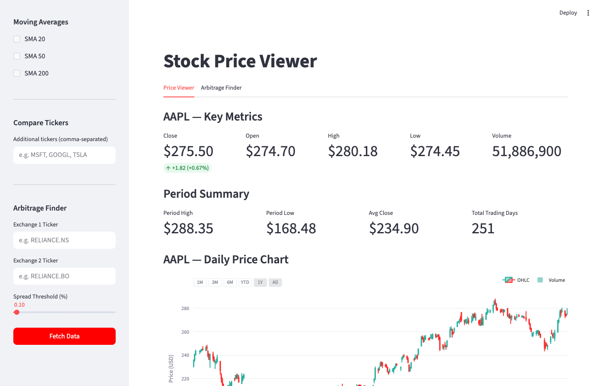
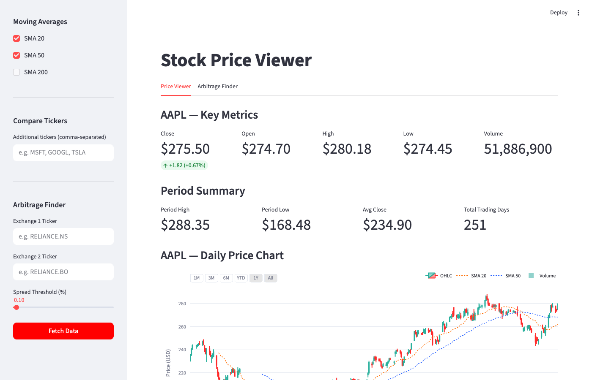
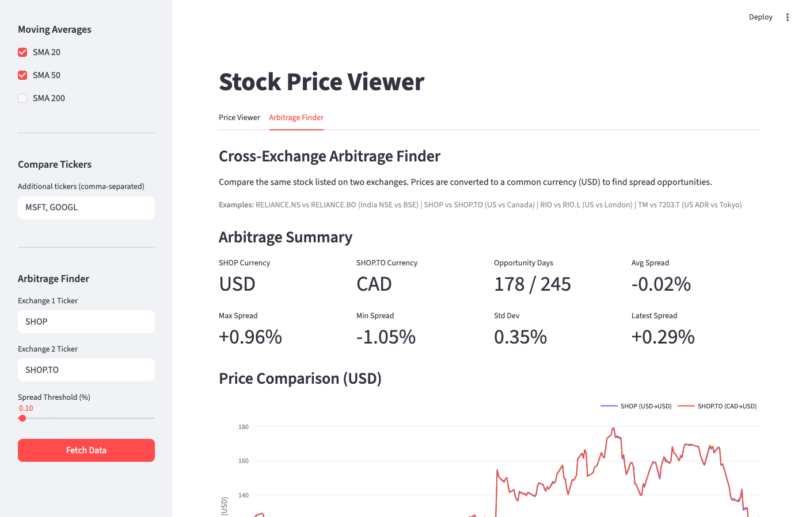

# Stock Price Viewer

A Streamlit-based interactive stock price viewer with cross-exchange arbitrage detection.

**Live App:** [https://jasminkaur9-stock-price-viewer.streamlit.app](https://jasminkaur9-stock-price-viewer.streamlit.app)

## Quick Start

```bash
pip install -r requirements.txt
streamlit run app.py
```

Open http://localhost:8501 in your browser.

## Screenshots

### Price Viewer — AAPL Candlestick Chart with Metrics


### Moving Average Overlays (SMA 20/50)


### Multi-Ticker Comparison


### Arbitrage Finder — SHOP (NYSE) vs SHOP.TO (TSX)


## Features

### Tab 1: Price Viewer
- **Data Collection** — Fetch daily OHLCV data via yfinance for any ticker
- **Key Metrics** — Latest close, open, high, low, volume with daily change
- **Interactive Chart** — Candlestick or line chart with Plotly (zoom, pan, hover)
- **Volume Subplot** — Color-coded volume bars (green = up, red = down)
- **Moving Averages** — SMA 20/50/200 overlays (togglable)
- **Range Selectors** — 1M, 3M, 6M, YTD, 1Y, All buttons
- **Multi-Ticker Comparison** — Normalized % change chart for comparing tickers
- **CSV Export** — Download OHLCV data as CSV

### Tab 2: Arbitrage Finder
- **Cross-Exchange Comparison** — Compare same stock on two exchanges
- **Auto Currency Conversion** — Detects currency, converts to USD via live forex
- **Sub-Unit Currency Handling** — Correctly handles GBp (pence), ILA, ZAc
- **Spread Analysis** — Daily spread chart with configurable threshold bands
- **Opportunity Detection** — Highlights days where |spread| exceeds threshold
- **Opportunity CSV Export** — Download arbitrage opportunities

## Tech Stack

| Component | Library | Version |
|-----------|---------|---------|
| UI Framework | Streamlit | 1.54+ |
| Data Source | yfinance | 1.1+ |
| Charts | Plotly | 6.5+ |
| Processing | pandas | 2.3+ |

## Validated Arbitrage Pairs

| Exchange 1 | Exchange 2 | Notes |
|-----------|-----------|-------|
| `SHOP` | `SHOP.TO` | US vs Canada (USD/CAD) — tight spread ~0.02% |
| `RIO` | `RIO.L` | US vs London (USD/GBp) — sub-unit currency handled |
| `RELIANCE.NS` | `RELIANCE.BO` | India NSE vs BSE (same currency) — near-zero spread |
| `TM` | `7203.T` | US ADR vs Tokyo (USD/JPY) |

---

## Development Process

This project was built on **February 12, 2026** using the [DRIVER workflow](https://github.com/anthropics/claude-code) (Define, Represent, Implement, Validate, Evolve, Reflect) — a structured product development process for AI-assisted finance tools.

### Stage 1: DEFINE (Research) — 10:15 AM EST

Parallel research was conducted to evaluate:
- **Data sources**: yfinance, Alpha Vantage, Polygon.io, Tiingo, Twelve Data — compared on cost, reliability, rate limits, and Python SDK quality.
- **Charting libraries**: Plotly, mplfinance, Altair, Bokeh — compared on interactivity, Streamlit integration, and financial chart support.

**Decision:** yfinance (free, zero-config) + Plotly (best-in-class candlestick support) + Streamlit (instant UI) selected as the optimal stack.

### Stage 2: REPRESENT (Roadmap) — 10:25 AM EST

Product broken into 3 buildable sections:
1. Data Collection & Display — fetch OHLCV, show metrics and table
2. Interactive Price Chart — Plotly candlestick/line with volume, SMA, range selectors
3. Enhancements — multi-ticker comparison, moving averages, CSV export

### Stage 3: IMPLEMENT (Build) — 10:30 AM – 10:50 AM EST

Each section was built incrementally and run immediately (show don't tell):

| Time | Section | What Was Built |
|------|---------|---------------|
| 10:30 AM | Section 1 | Sidebar controls, yfinance data fetch with caching, key metrics row, period summary, OHLCV data table |
| 10:37 AM | Section 2 | Plotly candlestick/line chart, volume subplot, range selector buttons (1M/3M/6M/YTD/1Y/All), unified hover |
| 10:42 AM | Section 3 | SMA 20/50/200 overlays, multi-ticker normalized comparison chart, CSV download |
| 10:48 AM | Bonus | Cross-exchange arbitrage finder — auto currency detection, forex conversion, spread analysis with threshold bands, opportunity table |

### Stage 4: VALIDATE (Cross-Check) — 10:50 AM – 10:53 AM EST

Four independent validation checks were executed:

| Check | Method | Result |
|-------|--------|--------|
| **Known Answers** | Compared AAPL OHLCV against raw yfinance output; verified SMA 20 rolling = manual mean of last 20 closes; hand-calculated SHOP/SHOP.TO arbitrage spread (+0.2904%) matched app output | PASS |
| **Reasonableness** | RELIANCE.NS vs .BO spread near 0% (same country/currency — expected); SHOP vs SHOP.TO avg spread -0.02% (liquid dual-listed — expected) | PASS |
| **Edge Cases** | Tested: invalid ticker (→ error), future dates (→ empty), single trading day (→ change=0), weekend-only range (→ empty), same ticker both inputs (→ spread=0%) | PASS |
| **AI Blind Spots** | Discovered `GBp` (pence) currency bug: yfinance reports London stocks in pence but `GBpUSD=X` returns same rate as `GBPUSD=X` — naive conversion gives **100x wrong** arbitrage spread. Fixed with sub-unit currency map (`GBp→GBP/100`, `ILA→ILS/100`, `ZAc→ZAR/100`) | BUG FOUND & FIXED |

### Stage 5: EVOLVE (Export) — 10:53 AM EST

Generated self-contained `driver-plan/` export package:
- `app.py` — Working application with all features
- `requirements.txt` — Pinned dependency versions
- `prompts/` — Ready-to-paste prompts for extending via coding agents
- `instructions/` — Milestone-by-milestone implementation guides
- `sections/arbitrage/tests.md` — pytest test specifications

### Stage 6: REFLECT (Learnings) — 10:53 AM EST

Key takeaways captured:
- **yfinance MultiIndex columns** — must flatten after every `yf.download()` call
- **Sub-unit currencies** — GBp/ILA/ZAc produce silent 100x errors if not handled; no error raised, just wrong numbers
- **Validation is not optional** for finance tools — the GBp bug would have gone undetected without systematic cross-checking

### Commit History

| Timestamp (EST) | Commit | Description |
|----------------|--------|-------------|
| 2026-02-12 10:53 AM | `dc2cc9d` | Initial app with all features (data, charts, arbitrage) |
| 2026-02-12 11:02 AM | `7cdeed9` | Automated Playwright screenshots of all key views |
| 2026-02-12 11:04 AM | `73781bd` | Screenshots added to README |
| 2026-02-12 11:05 AM | `bbd6708` | Streamlit Cloud deployment config |
| 2026-02-12 11:07 AM | `a4ab882` | Live app URL added to README |
